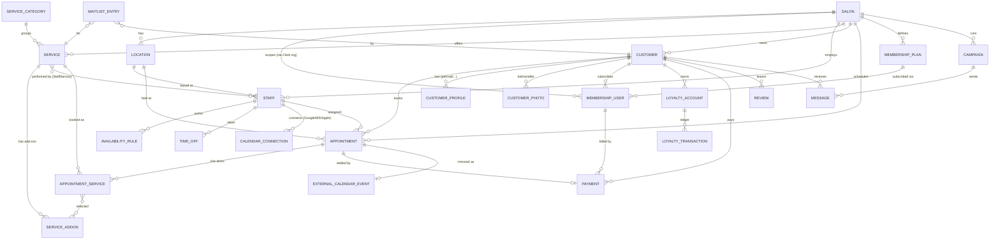

# 03 — Data Model, Schema & ERD

The runnable schema is in [`prisma/schema.prisma`](./prisma/schema.prisma). This document
explains the model and gives the ERD. Every tenant-owned table carries `salonId` and is
protected by the RLS policy described in `02-architecture.md`.

## 1. Entity-relationship diagram

## 2. Core entities & decisions

- **Salon (tenant root)** — mirrors a Clerk Organization. Holds business profile, default
  currency/locale/timezone, vertical (`hair|nails|beauty|spa|pet|barber|lash|brow`), public
  `slug`, and onboarding state. The vertical drives template seeding and which
  `CustomerProfile` type is offered.
- **Location** — a salon may have many (multi-location is data-modeled from day one even
  though it's post-MVP). Appointments and staff reference a location; single-location salons
  get one implicit location.
- **Staff** — links to a Clerk user (for login) but can also be a "resource only" member
  with no login (e.g. a room or a non-app-using stylist). Carries role, commission config,
  and bio for the booking page.
- **Service / ServiceCategory / ServiceAddon** — duration, price (minor units, integer),
  buffer-before/after, color, online-bookable flag, deposit policy. `StaffService` is the
  join controlling who performs what (and per-staff price/duration overrides).
- **Appointment** — the heart. Has `start`, `end`, `status`
  (`booked|confirmed|completed|cancelled|no_show`), `source` (`dashboard|online|marketplace|
  ai`), customer, primary staff, location. **AppointmentService** line items allow
  multi-service and group bookings; each line can have its own staff (for group/parallel
  services) and selected add-ons. `idempotencyKey` + external etags prevent sync echo loops.
- **CustomerProfile (vertical extension)** — one row per (customer, type) with a typed JSON
  `data` payload validated by a Zod schema per vertical:
  - *pet*: breed, weight, coatType, vaccinationRecords[], behaviourNotes
  - *nail*: nailHistory[], preferredTechnicianId, designGallery[]
  This keeps the core schema stable while supporting vertical depth — new verticals add a
  schema, not a migration.
- **CustomerPhoto** — S3 key + type (`before|after|reference`), linked to customer and
  optionally an appointment; powers nail/lash galleries.
- **Payment** — Stripe-backed; `kind` (`deposit|full|refund|gift_card|membership`), amount,
  Stripe ids, status. Links to appointment or membership.
- **MembershipPlan / MembershipUser** — plan (price, interval, included services, discount
  %, loyalty multiplier) and the subscription instance (Stripe subscription id, status,
  renewal date, included-service usage counters).
- **LoyaltyAccount / LoyaltyTransaction** — points balance + append-only ledger (earn,
  redeem, referral, birthday, adjustment). VIP tier derived from lifetime points/spend.
- **CalendarConnection** — per-staff OAuth connection (`provider`, encrypted tokens,
  `syncToken`/`deltaLink`, channel/subscription id, expiry). **ExternalCalendarEvent**
  records the mirror linkage and etag for echo-loop prevention.
- **Campaign / Message** — campaign (type: confirmation, reminder, review, rebooking,
  birthday, win-back; channel: sms/email/whatsapp; trigger/schedule) and per-recipient
  Message rows (status, provider id, delivery + read receipts).
- **WaitlistEntry** — customer wants service X in a date window; the `fill-empty-slots`
  worker and AI assistant match cancellations to waitlist entries.
- **Review** — rating + text, tied to a completed appointment; aggregated onto the salon for
  the marketplace.
- **AuditLog & OutboxEvent** — `OutboxEvent` is the transactional outbox (event type,
  payload, published flag); `AuditLog` records sensitive actions (refunds, role changes,
  data exports) for compliance.

## 3. Conventions

- **IDs**: UUID v7 (time-sortable) primary keys; plus short public `slug`/`publicId` on
  externally-referenced entities (salon, service, staff) for clean URLs and the marketplace.
- **Money**: integers in minor units + ISO currency code. Never floats.
- **Time**: all timestamps stored UTC; salon/location timezone applied at presentation.
  Appointments store start/end UTC + the IANA tz at time of booking (DST-safe).
- **Soft delete**: `deletedAt` on customer-facing records (legal retention + undo); hard
  delete only on GDPR erasure, which also redacts message/audit history.
- **Indexes**: composite `(salonId, start)` on appointments (calendar range scans),
  `(salonId, staffId, start)`, `(salonId, customerId)`, partial index on
  `appointments WHERE status IN ('booked','confirmed')` for conflict checks, `(salonId,
  publishedAt)` on outbox.

See `prisma/schema.prisma` for the concrete field-level definition (a representative core;
loyalty/campaign sub-tables are summarized there and expanded as the build proceeds).
